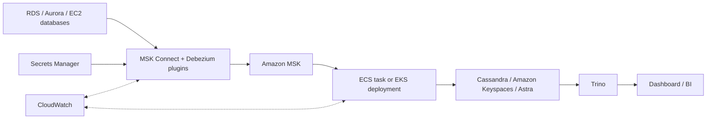

# AWS Deployment Skeleton

Use this path when Kafka is strategic and the CDC contract should remain Kafka-compatible across sources and consumers.

## Files

- `main.tf`: infrastructure skeleton for MSK Connect workers, connector placeholders, replay job log groups, and runtime IAM boundaries.
- `variables.tf`: required environment inputs.
- `outputs.tf`: integration values for downstream deployment stages.

## Production Decisions

- Source credentials and TLS material come from Secrets Manager.
- MSK Connect uses TLS in transit.
- Connector configs are supplied through `var.connectors`; CDCV2-016 will add production connector templates that consume `docs/v2/security-controls.json`.
- Transformer can run as ECS, EKS, or AWS Batch. This skeleton exposes the inputs those runtimes need without choosing one prematurely.
