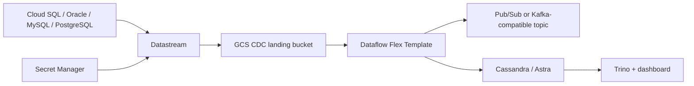

# GCP Deployment Skeleton

Use this path when the target analytics platform is GCP-native or when managed Datastream/Dataflow operations are preferred.

## Files

- `main.tf`: Datastream private connectivity, stream placeholders, Dataflow Flex Template job, and service account boundaries.
- `variables.tf`: environment inputs.
- `outputs.tf`: integration values for downstream stages.

## Production Decisions

- Use private connectivity for source databases.
- Store credentials and certificates in Secret Manager.
- Use Dataflow for managed transformations when the target is GCS/BigQuery/Cassandra-compatible sinks.
- Use GKE-hosted Debezium instead of Datastream when Kafka topic semantics must exactly match the local demo. In that mode, start from `connectors/production/` and replace the `secrets` config provider with the approved GCP Secret Manager provider.
