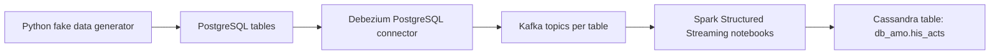
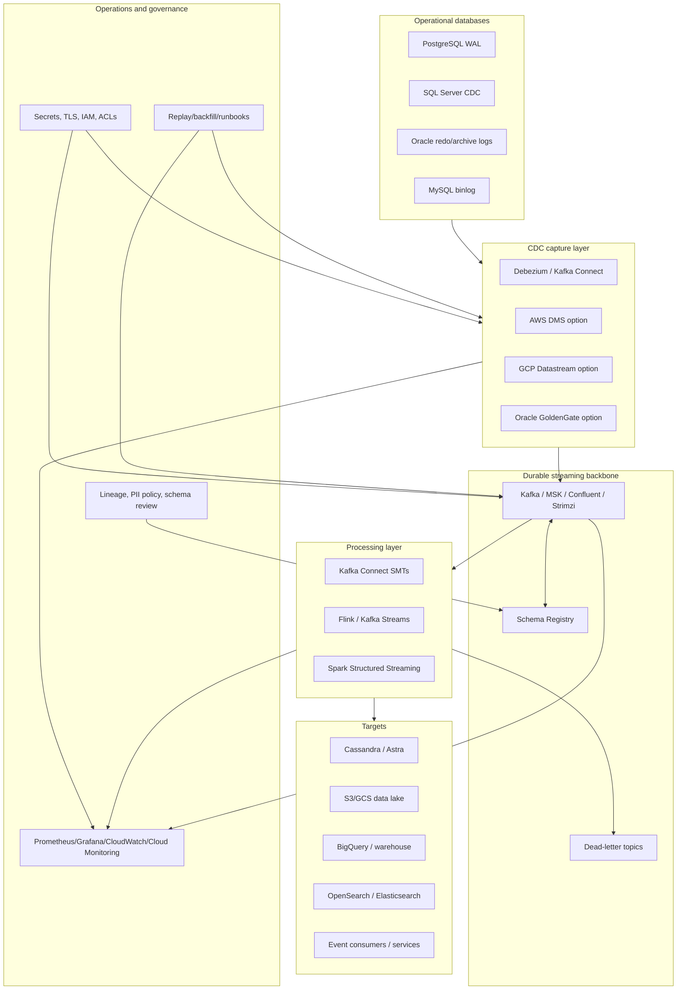
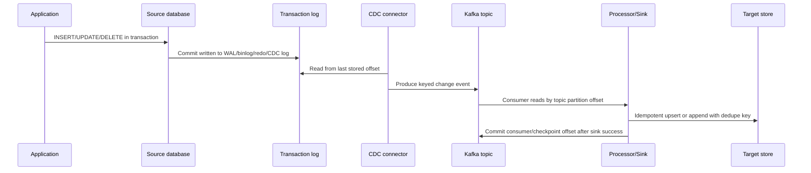
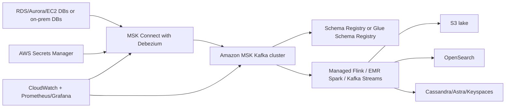
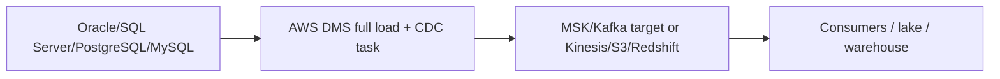
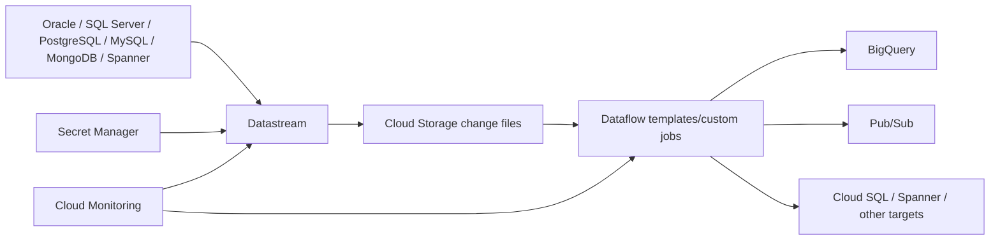
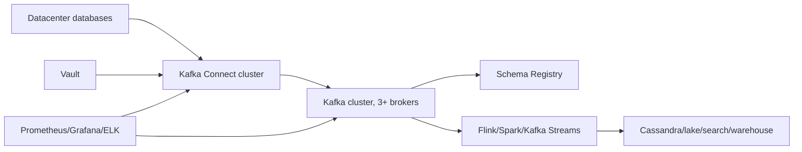

# Production CDC Architecture and Interview Guide

Generated: 2026-05-07

This document explains what this repository demonstrates, what is missing for production, and how to design a production-grade Change Data Capture (CDC) platform for PostgreSQL, Oracle, SQL Server, MySQL, and mixed cloud/datacenter environments.

The goal is not only to "make the demo run." The goal is to show that you understand CDC as a reliability, data-contract, operations, and governance problem.

## 1. Executive Summary

This repository is a local CDC demo:

```text
Python generator -> PostgreSQL -> Debezium -> Kafka -> Spark -> Cassandra
```

For production, the architecture should become:

```text
Source DB transaction logs
  -> CDC capture layer
  -> durable streaming backbone
  -> schema/governance layer
  -> stream processing and sink connectors
  -> target databases, lakehouse, search, analytics, services
  -> monitoring, alerting, replay, audit, and runbooks
```

The strongest interview message:

> I would not treat CDC as a script that copies rows. I would treat it as a production data platform. The source database log is the input, Kafka or a managed stream is the durable event contract, schemas are governed, consumers are idempotent, offsets are monitored, and every source/target has an explicit recovery and replay strategy.

### 1.1 Two-minute whiteboard narrative

If you have to explain the whole topic quickly, use this sequence:

1. Start with the source database transaction log, not with Kafka.
2. Explain that Debezium/DMS/Datastream/GoldenGate captures committed changes from that log.
3. Put Kafka or a managed stream in the middle to decouple source capture from all consumers.
4. Put Schema Registry and topic naming rules next to Kafka because CDC events are contracts.
5. Put Spark/Flink/Kafka Streams only where transformation is needed.
6. Put Cassandra/lake/search/warehouse as separate target projections.
7. Finish with the production concerns: idempotency, replay, schema evolution, secrets, monitoring, DLQ, and runbooks.

Say it like this:

> The connector reads committed changes from the database log and publishes them as keyed events. Kafka gives us durability, ordering per key, retention, replay, and fan-out. Consumers are idempotent because the platform is at-least-once. Schema Registry protects consumers from breaking changes. The production work is not only the connector; it is permissions, log retention, topic design, schema governance, monitoring, DLQ, replay, and target recovery.

## 2. Current Project Analysis

### What the current repo does

The demo starts these services with Docker Compose:

- PostgreSQL as the source database.
- A Python producer that inserts and updates fake rows.
- Debezium Kafka Connect to read PostgreSQL changes.
- Kafka and Zookeeper as the event backbone.
- Schema Registry.
- Spark and Jupyter to consume Kafka topics.
- Cassandra as the target database.

The intended event path is:



### What is good for a demo

- It uses log-based CDC instead of polling.
- It separates source capture from stream processing using Kafka.
- It shows insert/update propagation from source tables to a target.
- It introduces the right tools: Debezium, Kafka Connect, Spark, Cassandra.

### What is not production ready

| Area | Current state | Production requirement |
|---|---|---|
| Infrastructure | Single-node Docker Compose | Multi-AZ or multi-node managed/self-managed deployment |
| Secrets | Plain credentials in YAML/JSON/Python | Secrets manager, rotation, least privilege |
| Source DB setup | Manual README commands | Versioned migrations and DBA-approved runbook |
| Debezium config | One JSON file | Config-as-code, environment overlays, CI validation |
| Kafka | Single broker | Replication, retention policy, ACLs, TLS, quotas |
| Kafka Connect | Single container | Distributed workers, internal topics RF 3, task monitoring |
| Schema evolution | Not enforced | Schema Registry compatibility rules and data contracts |
| Spark | Notebook job | Packaged streaming app with checkpoints, CI/CD, restart policy |
| Cassandra sink | One table, append only | Idempotent writes, target model, replay strategy, DLQ |
| Observability | Minimal | Metrics, logs, lag, alerts, dashboards, SLOs |
| Recovery | Manual | Tested replay, backfill, resnapshot, failover runbooks |
| Governance | None | PII masking, lineage, ownership, access controls |

## 3. Production CDC Principles

### 3.1 Prefer log-based CDC

Production CDC should read the database transaction mechanism:

- PostgreSQL: WAL logical decoding.
- MySQL/MariaDB: binlog.
- SQL Server: transaction log through SQL Server CDC tables.
- Oracle: redo/archive logs through LogMiner, XStream, OpenLogReplicator, Oracle GoldenGate, or a managed service.

Avoid naive polling based on `updated_at` unless the database cannot support log-based CDC. Polling misses deletes, has timestamp race conditions, increases source load, and usually cannot preserve transaction ordering.

### 3.2 Accept at-least-once behavior

Even if a connector is fault tolerant, duplicate events can happen after failures because offsets are committed periodically, not necessarily after every source change. Therefore:

- Consumers and sinks must be idempotent.
- Event keys must be stable.
- Target writes should be upserts or deduplicated appends.
- Use source log position and operation timestamp as dedupe metadata.

Do not promise "exactly once end-to-end" unless every component in the chain is configured and proven for it. A safer statement is:

> The platform is designed for at-least-once delivery with idempotent consumers. Where supported, we use transactional/idempotent producers and checkpointing, but the correctness guarantee is enforced at the sink.

### 3.3 Separate raw CDC from business events

Raw CDC events are database facts:

```text
table row changed from before -> after at log position X
```

Business events are domain facts:

```text
OrderPaid, PolicyCancelled, StockReserved
```

Use raw CDC for replication, audit, search indexing, cache refresh, and analytics ingestion. Use the outbox pattern when services need reliable business events with intentional domain semantics.

### 3.4 Preserve ordering where it matters

Kafka ordering is per partition, not globally across all topics. For CDC:

- Partition by stable primary key for per-row ordering.
- Keep all changes for one source row on the same partition.
- Do not repartition randomly in stream processors.
- If cross-table transaction ordering matters, capture and propagate transaction metadata.
- If the target requires global ordering, design for one partition or a transaction-aware consumer, accepting lower throughput.

### 3.5 Treat schema as a contract

CDC events evolve when the source schema changes. Production systems need:

- Avro, Protobuf, or JSON Schema with Schema Registry.
- Compatibility mode, commonly `BACKWARD` or `BACKWARD_TRANSITIVE`.
- Explicit rules for adding/removing/renaming/changing columns.
- A data contract owner for each source topic.
- Consumer compatibility tests before schema changes reach production.

## 4. Target Production Architecture

### 4.1 Recommended canonical architecture



### 4.2 Event lifecycle



### 4.3 Topic strategy

Use clear naming:

```text
cdc.<env>.<source_system>.<database>.<schema>.<table>
```

Examples:

```text
cdc.prod.his.postgres.public.his_drugs
cdc.prod.erp.oracle.claims.claim_header
cdc.prod.crm.sqlserver.dbo.customer
```

Recommended topic defaults:

| Topic type | Cleanup | Retention | Notes |
|---|---|---|---|
| Raw CDC table topics | delete, sometimes compact+delete | Enough for replay and outages, commonly days to weeks | Keep raw history for recovery |
| Latest-state topics | compact | Long-lived | Derived from CDC, keyed by PK |
| DLQ topics | delete | Long enough for investigation | Include error context headers |
| Connect internal topics | compact | Long-lived | Replication factor >= 3 in production |
| Schema history topics | compact | Long-lived | Never casually delete |

### 4.4 Key design

Every CDC event should have:

- `key`: stable primary key or composite key.
- `source`: database, schema, table, connector, log position.
- `op`: create, update, delete, read/snapshot.
- `ts_ms`: source or connector event timestamp.
- `before`: row before change when available.
- `after`: row after change when available.
- `transaction`: optional transaction id/order metadata.

For Cassandra, a good history model is often:

```sql
CREATE TABLE product_change_history (
  product_id text,
  source_table text,
  source_lsn text,
  event_ts timestamp,
  op text,
  payload text,
  PRIMARY KEY ((product_id), event_ts, source_lsn)
) WITH CLUSTERING ORDER BY (event_ts DESC);
```

For latest state:

```sql
CREATE TABLE product_current_state (
  product_id text PRIMARY KEY,
  source_table text,
  description text,
  dci_code text,
  dci_description text,
  last_source_lsn text,
  last_event_ts timestamp,
  deleted boolean
);
```

Use history for audit and replay. Use current-state tables for queries.

## 5. Source Database Playbooks

### 5.0 Source selection matrix

| Source | Preferred CDC mechanism | Common production tool | Main risk |
|---|---|---|---|
| PostgreSQL | WAL logical decoding | Debezium PostgreSQL connector | Replication slot lag can retain WAL and fill disk |
| MySQL/MariaDB | Row-based binlog | Debezium MySQL connector, DMS, Datastream | Binlog retention and failover position handling |
| SQL Server | Native SQL Server CDC over transaction log | Debezium SQL Server connector, DMS, Datastream | CDC retention cleanup can remove unread changes |
| Oracle | Redo/archive log mining | Debezium Oracle, GoldenGate, DMS, Datastream | Supplemental logging, privileges, redo volume, licensing |
| MongoDB | Change streams/oplog | Debezium MongoDB, native change streams | Oplog retention and document schema drift |

### 5.0.1 Tool selection matrix

| Scenario | Strong choice | Why |
|---|---|---|
| Kafka is the enterprise event backbone | Debezium + Kafka Connect | Standard CDC envelopes, replay, fan-out, connector ecosystem |
| AWS migration or managed replication | AWS DMS | Managed full load plus CDC, many AWS targets |
| GCP analytics into BigQuery | Datastream + Dataflow | Serverless CDC path into GCP analytics stack |
| Oracle-heavy enterprise | Oracle GoldenGate | Mature Oracle replication product with enterprise support |
| Simple topic-to-target copy | Kafka Connect sink | Avoid Spark/Flink unless transformation is needed |
| Stateful joins/enrichment/windowing | Flink, Spark, or Kafka Streams | Stream processor is justified by transformation complexity |

### 5.1 PostgreSQL

Best tool: Debezium PostgreSQL connector.

How it works:

- PostgreSQL logical decoding extracts committed changes from WAL.
- Debezium uses a replication slot and an output plugin, commonly `pgoutput`.
- The first run usually performs a consistent snapshot, then streams changes from the captured WAL position.

Production setup:

```sql
ALTER SYSTEM SET wal_level = logical;
ALTER SYSTEM SET max_replication_slots = 10;
ALTER SYSTEM SET max_wal_senders = 10;
```

Create a dedicated user:

```sql
CREATE ROLE debezium_user WITH LOGIN PASSWORD '<from-secret-manager>' REPLICATION;
GRANT CONNECT ON DATABASE appdb TO debezium_user;
GRANT USAGE ON SCHEMA public TO debezium_user;
GRANT SELECT ON ALL TABLES IN SCHEMA public TO debezium_user;
ALTER DEFAULT PRIVILEGES IN SCHEMA public GRANT SELECT ON TABLES TO debezium_user;
```

For tables where updates/deletes need full before images:

```sql
ALTER TABLE public.his_drugs REPLICA IDENTITY FULL;
```

Production concerns:

- Monitor replication slot lag and WAL disk growth.
- Decide table include/exclude lists.
- Never grant superuser if a narrower replication role works.
- Coordinate DDL changes with schema compatibility.
- Plan failover: replication slots and publications must exist on the promoted primary or be recreated safely.

### 5.2 MySQL / MariaDB

Best tool: Debezium MySQL connector or managed DMS/Datastream.

How it works:

- MySQL writes committed row changes to the binary log.
- Debezium reads the binlog and emits row-level insert/update/delete events.

Production setup:

```ini
server-id=223344
log_bin=mysql-bin
binlog_format=ROW
binlog_row_image=FULL
expire_logs_days=7
gtid_mode=ON
enforce_gtid_consistency=ON
```

Production concerns:

- Retain binlogs long enough for connector downtime.
- Prefer GTID-based failover where possible.
- Avoid connecting CDC to a replica that can fall behind or lose required binlogs.
- Use one logical server name per source cluster.
- Validate snapshot locks on managed databases such as RDS/Aurora.

### 5.3 SQL Server

Best tool: Debezium SQL Server connector, AWS DMS, GCP Datastream, or native CDC consumers.

How it works:

- SQL Server CDC records inserts, updates, and deletes into change tables.
- SQL Server Agent capture and cleanup jobs manage CDC extraction and retention.
- Debezium reads SQL Server CDC tables and tracks LSN offsets.

Production setup:

```sql
EXEC sys.sp_cdc_enable_db;

EXEC sys.sp_cdc_enable_table
  @source_schema = N'dbo',
  @source_name   = N'customer',
  @role_name     = N'cdc_reader',
  @supports_net_changes = 1;
```

Production concerns:

- SQL Server Agent must run.
- CDC retention must exceed maximum connector outage plus recovery time.
- Monitor CDC cleanup; aggressive cleanup can cause missed changes.
- Understand update semantics: SQL Server CDC can expose before and after update rows.
- Large transactions can increase log and CDC latency.

### 5.4 Oracle

Best tools:

- Debezium Oracle connector for open-source Kafka CDC.
- Oracle GoldenGate for Oracle-heavy enterprises with licensing and DBA support.
- AWS DMS or GCP Datastream for managed cloud replication.

How it works:

- Oracle CDC reads redo/archive logs.
- Debezium supports LogMiner, XStream, and OpenLogReplicator adapter modes.
- Oracle setups usually require ARCHIVELOG mode, supplemental logging, redo sizing, and a privileged capture user.

Production setup examples:

```sql
ALTER DATABASE ARCHIVELOG;
ALTER DATABASE ADD SUPPLEMENTAL LOG DATA;
ALTER TABLE APP.CUSTOMER ADD SUPPLEMENTAL LOG DATA (ALL) COLUMNS;
```

Production concerns:

- Oracle CDC is DBA-heavy. Get redo retention, archive destinations, and supplemental logging approved.
- Large transactions may require more connector memory, especially with LogMiner buffering.
- For high-volume Oracle, evaluate GoldenGate or a downstream mining database to reduce load on the primary.
- Be explicit about licensing for XStream/GoldenGate.
- Test DDL, LOB, XML, numeric, timezone, and character-set edge cases.

### 5.5 MongoDB and NoSQL sources

Best tool: Debezium MongoDB connector, MongoDB change streams, or managed services.

Production concerns:

- Use replica sets or sharded clusters that support change streams/oplog-based capture.
- Track resume tokens.
- Keep oplog retention long enough for outages.
- Expect document-level schema drift; use schema validation or consumer-side normalization.

## 6. Cloud and Datacenter Deployment Options

### 6.1 AWS architecture

Recommended AWS option when Kafka is strategic:



Use this when:

- You want Kafka as the long-term event backbone.
- Multiple consumers need raw CDC.
- You need replay, DLQs, topic retention, and event contracts.
- You already run MSK or Confluent Cloud.

Recommended AWS option for migration/simple replication:



Use DMS when:

- The project is primarily migration or replication.
- You need quick setup and AWS-managed operations.
- The target is S3, Redshift, Kinesis, MSK, or another AWS endpoint.

Be careful with DMS when:

- You need Debezium-compatible event envelopes.
- You need one topic per table by default.
- You need advanced Kafka Connect SMTs and connector ecosystem behavior.

AWS config handling:

- Store connector secrets in AWS Secrets Manager.
- Use IAM roles for MSK Connect.
- Store connector JSON/YAML in Git.
- Deploy with Terraform/CDK/CloudFormation.
- Use CloudWatch for managed service metrics and Prometheus/Grafana for Kafka/JMX where needed.

### 6.2 GCP architecture

Recommended GCP-native option:



Use Datastream when:

- The target is BigQuery or Google data services.
- You want serverless CDC and low operational overhead.
- You want managed backfill plus CDC.

Use Debezium on GKE or Confluent Cloud when:

- Kafka is already the enterprise standard.
- Non-GCP consumers need Kafka topics.
- You need Debezium envelopes, transformations, and custom connectors.

GCP config handling:

- Store secrets in Secret Manager.
- Use private connectivity: VPC peering, Private Service Connect, VPN, or Interconnect.
- Keep stream definitions and Dataflow templates in Terraform.
- Monitor stream freshness, errors, and Dataflow backlog in Cloud Monitoring.

### 6.3 On-prem / datacenter architecture

Recommended self-managed architecture:



Use this when:

- Databases cannot expose logs to cloud services.
- Low-latency local replication is required.
- Compliance requires data to stay on-prem.
- The organization has platform/SRE capacity.

Datacenter requirements:

- Three or more Kafka brokers across racks/availability zones.
- Three or more Kafka Connect workers in distributed mode.
- TLS everywhere.
- SASL/mTLS authentication.
- Kafka ACLs per connector and consumer group.
- Vault or equivalent for dynamic database credentials.
- Prometheus/Grafana for JMX metrics.
- Centralized logs and alerting.
- Disaster recovery cluster or backup/restore strategy.

## 7. Configuration Management

### 7.1 What belongs in Git

Store this in Git:

```text
cdc/
  environments/
    dev/
    qa/
    prod/
  connectors/
    postgres-his-drugs.yaml
    oracle-claims.yaml
    sqlserver-crm-customer.yaml
  topics/
    cdc.prod.his.postgres.public.his_drugs.yaml
  schemas/
    his_drugs-value.avsc
  sink-mappings/
    cassandra-product-history.yaml
  runbooks/
    resnapshot-table.md
    connector-restart.md
    replay-to-cassandra.md
```

Do not store:

- Passwords.
- Private keys.
- Database connection secrets.
- TLS private material.
- Production connection strings with credentials.

### 7.2 Environment overlay model

Use a base connector definition and environment overlays.

Base:

```yaml
name: postgres-his
connector.class: io.debezium.connector.postgresql.PostgresConnector
plugin.name: pgoutput
topic.prefix: cdc.${env}.his.postgres
table.include.list:
  - public.his_drugs
  - public.his_devices
  - public.his_medicals
snapshot.mode: initial
decimal.handling.mode: string
time.precision.mode: adaptive_time_microseconds
include.schema.changes: true
```

Production overlay:

```yaml
database.hostname: ${secret:prod/cdc/postgres/host}
database.port: 5432
database.user: ${secret:prod/cdc/postgres/user}
database.password: ${secret:prod/cdc/postgres/password}
database.dbname: postgres
slot.name: debezium_his_prod
publication.name: dbz_his_prod
heartbeat.interval.ms: 10000
errors.log.enable: true
errors.log.include.messages: false
```

The exact secret interpolation syntax depends on the platform, but the principle is stable: Git stores references to secrets, not secret values.

### 7.3 CI/CD validation

Before deploying a CDC connector:

1. Validate JSON/YAML syntax.
2. Validate required connector fields.
3. Validate topic naming convention.
4. Validate table include list against an approved source inventory.
5. Validate schema compatibility.
6. Check that the connector principal has only required database permissions.
7. Check Kafka ACLs and topic existence.
8. Deploy to dev and run a test insert/update/delete.
9. Promote the same artifact to QA/prod with environment-specific values.

### 7.4 Secrets strategy

| Environment | Recommended secrets tool |
|---|---|
| AWS | AWS Secrets Manager or Parameter Store plus KMS |
| GCP | Secret Manager plus IAM and CMEK if needed |
| Kubernetes | External Secrets Operator or Secrets Store CSI Driver backed by cloud secret manager or Vault |
| Datacenter | HashiCorp Vault or enterprise password/secret manager |
| Local dev | `.env.local`, never committed |

Rules:

- Rotate database credentials.
- Use dedicated CDC users per source system.
- Separate source credentials from sink credentials.
- Do not share connector users across unrelated databases.
- Use read/replication privileges only; avoid DBA/superuser.
- Use TLS for DB, Kafka, Schema Registry, and sink traffic.

## 8. Reliability and Recovery

### 8.1 Availability design

Kafka:

- Minimum 3 brokers in production.
- Replication factor 3 for CDC topics.
- `min.insync.replicas` at least 2.
- Retention long enough for replay and operational outages.
- Monitor under-replicated partitions and disk usage.

Kafka Connect:

- Distributed mode, at least 3 workers.
- Internal topics with replication factor 3.
- Rolling restarts only.
- Separate Connect clusters for source CDC and sink connectors when blast radius matters.
- Pin connector/plugin versions.

Source DB:

- Confirm log retention with DBA.
- Monitor WAL/binlog/redo/CDC table growth.
- Confirm HA/failover behavior before production.

Processor:

- If using Spark, use durable checkpoint storage.
- If using Flink/Kafka Streams, use checkpoints/state backend and restart policies.
- Do not run production streaming logic from notebooks.

Sink:

- Writes must be idempotent.
- Keep a dedupe key from source metadata.
- Store source offset/LSN/SCN/binlog file+position in the target when useful.

### 8.2 Failure modes and handling

| Failure | Symptom | Response |
|---|---|---|
| Connector stopped | Kafka topic stops receiving events | Restart connector, check DB log retention before resuming |
| Source log purged | Connector cannot resume from old offset | Resnapshot affected tables or restore logs |
| Kafka broker loss | Produce/consume errors, ISR drops | Use RF 3, min ISR, alert on under-replication |
| Bad schema change | Consumers fail deserialization | Pause rollout, restore compatible schema or deploy consumer fix |
| Poison message | Sink connector task fails | Route to DLQ where safe, fix mapping, replay |
| Slow consumer | Consumer lag grows | Scale consumers, tune batch size, inspect sink latency |
| Target outage | Consumer retries, lag grows | Keep Kafka retention high enough, use backpressure and retry policy |
| Duplicate events | Replays after restart | Idempotent writes and dedupe keys |
| Delete handling bug | Deleted rows remain in target | Define tombstone/delete policy and test it |

### 8.3 Backfill and resnapshot strategy

Production CDC always needs a backfill plan:

1. Initial snapshot for new tables.
2. Incremental snapshot for large existing tables where supported.
3. Target-side rebuild from raw Kafka topics when retention allows.
4. Historical reload from object storage when Kafka retention is not enough.
5. Manual correction process for small bad ranges.

Recommended rule:

> Never rely on only the live stream for recovery. Either Kafka retention or a raw object-store archive must be long enough to rebuild important targets.

### 8.4 Delete strategy

Choose per target:

| Target type | Recommended delete handling |
|---|---|
| Current-state table | Mark `deleted=true` or delete row |
| Audit/history table | Append delete event |
| Search index | Delete document |
| Lakehouse | Append tombstone row; downstream model handles it |
| Cache | Evict key |

For Cassandra specifically, be careful with frequent hard deletes because tombstones can hurt read performance. A soft-delete flag is often better for current-state tables.

## 9. Data Modeling for This Repo

The current repo writes four source tables into one Cassandra table called `his_acts`. That is fine for a demo, but production needs a clearer target model.

### 9.1 Recommended raw event table

```sql
CREATE TABLE db_amo.product_cdc_events (
  source_system text,
  source_database text,
  source_schema text,
  source_table text,
  product_id text,
  event_ts timestamp,
  source_position text,
  op text,
  payload_json text,
  PRIMARY KEY ((source_system, source_table, product_id), event_ts, source_position)
) WITH CLUSTERING ORDER BY (event_ts DESC);
```

### 9.2 Recommended current-state table

```sql
CREATE TABLE db_amo.product_current (
  product_id text PRIMARY KEY,
  product_type text,
  description text,
  dci_code text,
  dci_description text,
  deleted boolean,
  last_op text,
  last_event_ts timestamp,
  last_source_position text
);
```

### 9.3 Why two tables

- History table answers: "What changed and when?"
- Current table answers: "What is the latest value?"
- Different query patterns need different Cassandra primary keys.
- A single append table does not efficiently support current-state queries.

## 10. Observability

### 10.1 Metrics to monitor

Source DB:

- PostgreSQL replication slot lag and retained WAL bytes.
- MySQL binlog retention and connector position.
- SQL Server CDC job status, CDC retention, log growth.
- Oracle redo/archive log generation, mining lag, archive destination space.

CDC connector:

- Connector status: RUNNING/FAILED/PAUSED.
- Task status and task trace.
- Snapshot running/completed.
- Source lag in ms.
- Number of events captured.
- Error count.
- Queue remaining capacity.
- Last event timestamp.

Kafka:

- Broker health.
- Under-replicated partitions.
- Offline partitions.
- Topic bytes in/out.
- Producer errors.
- Consumer lag.
- Disk usage.
- Controller health.

Schema Registry:

- Compatibility failures.
- Schema count and versions.
- Availability and latency.

Processors/sinks:

- Input rows per second.
- Processing latency.
- Checkpoint duration.
- Failed batches.
- DLQ count.
- Target write latency.
- Target throttling.

### 10.2 Minimum alert set

| Alert | Example threshold |
|---|---|
| Connector task failed | Any task failed for more than 2 minutes |
| Source lag high | Lag > agreed RPO, for example 5 minutes |
| WAL/binlog/redo disk pressure | > 80% disk or retention at risk |
| Kafka under-replicated partitions | > 0 for more than 5 minutes |
| DLQ increasing | > 0 in critical connector, or rate above baseline |
| Consumer lag increasing | Lag grows for 15 minutes |
| Schema compatibility failure | Any prod schema registration failure |
| Target write errors | Error rate above threshold |

### 10.3 Useful dashboards

Dashboard 1: Executive CDC health

- Freshness by source table.
- Events per minute.
- Failed connectors.
- DLQ count.
- Consumer lag.

Dashboard 2: Connector deep dive

- Snapshot progress.
- Source offset/LSN/SCN/binlog position.
- Queue size.
- Error traces.
- Task restarts.

Dashboard 3: Infrastructure

- Kafka broker health.
- Connect worker CPU/memory.
- JVM GC.
- Network throughput.
- Disk usage.

## 11. Security and Governance

### 11.1 Least privilege

Use one dedicated CDC user per source database or application boundary.

Do:

- Grant replication/log-read permissions only where required.
- Grant SELECT only on captured tables.
- Use TLS to databases and Kafka.
- Use Kafka ACLs per connector.
- Mask or drop PII columns at capture or processing layer when policy requires it.

Do not:

- Use `postgres`/`sa`/`sys`/DBA accounts as connector users.
- Put passwords in Docker Compose, connector JSON, notebooks, or Git.
- Let every consumer read every CDC topic.

### 11.2 PII and compliance

CDC can expose sensitive fields that application APIs normally hide. Production design must include:

- Source table classification.
- Column-level PII inventory.
- Masking, hashing, tokenization, or exclusion.
- Access controls on raw topics.
- Retention policy by data classification.
- Audit logs for connector changes and topic access.

### 11.3 Data lineage

Each CDC pipeline should publish metadata:

- Source system owner.
- Source database/schema/table.
- Connector name and version.
- Destination topics and targets.
- Transformation logic.
- Data classification.
- On-call owner.

## 12. Implementation Roadmap for This Repository

### Phase 1: Make the local demo deterministic

- Move Postgres DDL from README into `postgres/init.sql`.
- Add Cassandra init CQL.
- Add a startup script that waits for Postgres before starting the generator.
- Remove hard-coded credentials from Python and Docker Compose.
- Add `.env.example`.
- Add connector registration script.
- Add Makefile targets:
  - `make up`
  - `make register-connector`
  - `make create-cassandra-schema`
  - `make smoke-test`

### Phase 2: Replace notebook streaming with a packaged job

- Convert the Spark notebook into a Python package or submitted Spark app.
- Add checkpoint locations.
- Add one checkpoint per query.
- Add DLQ output for parse/write failures.
- Add idempotent writes into Cassandra.
- Add tests for insert, update, delete, and duplicate event replay.

### Phase 3: Production-grade local stack

- Use multiple Kafka brokers locally or in a test environment.
- Use Kafka Connect distributed worker config.
- Configure Schema Registry compatibility.
- Use Avro/Protobuf/JSON Schema converters.
- Add Prometheus and Grafana.
- Add JMX exporter for Kafka Connect/Debezium.
- Add Kafka UI only for non-prod.

### Phase 4: Cloud/on-prem deployment

- Write Terraform for AWS/GCP/on-prem Kubernetes.
- Store secrets in the platform secret manager.
- Deploy connectors from CI/CD.
- Add canary connector and smoke tests.
- Add replay/resnapshot runbooks.
- Add operational dashboards.

## 13. Example Production Connector Configs

### 13.1 PostgreSQL Debezium connector

```json
{
  "name": "postgres-his-prod",
  "config": {
    "connector.class": "io.debezium.connector.postgresql.PostgresConnector",
    "plugin.name": "pgoutput",
    "database.hostname": "${secrets:postgres/host}",
    "database.port": "5432",
    "database.user": "${secrets:postgres/user}",
    "database.password": "${secrets:postgres/password}",
    "database.dbname": "postgres",
    "topic.prefix": "cdc.prod.his.postgres",
    "slot.name": "dbz_his_prod",
    "publication.name": "dbz_his_prod",
    "table.include.list": "public.his_drugs,public.his_devices,public.his_medicals",
    "snapshot.mode": "initial",
    "heartbeat.interval.ms": "10000",
    "include.schema.changes": "true",
    "decimal.handling.mode": "string",
    "tombstones.on.delete": "true",
    "transforms": "unwrap",
    "transforms.unwrap.type": "io.debezium.transforms.ExtractNewRecordState",
    "transforms.unwrap.delete.handling.mode": "rewrite",
    "transforms.unwrap.add.fields": "op,table,source.ts_ms,lsn"
  }
}
```

Note: whether to unwrap Debezium events depends on the consumer. Keep raw envelopes if consumers need before/after/source metadata.

### 13.2 SQL Server Debezium connector

```json
{
  "name": "sqlserver-crm-prod",
  "config": {
    "connector.class": "io.debezium.connector.sqlserver.SqlServerConnector",
    "database.hostname": "${secrets:sqlserver/host}",
    "database.port": "1433",
    "database.user": "${secrets:sqlserver/user}",
    "database.password": "${secrets:sqlserver/password}",
    "database.names": "CRM",
    "topic.prefix": "cdc.prod.crm.sqlserver",
    "table.include.list": "dbo.customer,dbo.account",
    "snapshot.mode": "initial",
    "include.schema.changes": "true",
    "decimal.handling.mode": "string",
    "heartbeat.interval.ms": "10000"
  }
}
```

### 13.3 Oracle Debezium connector

```json
{
  "name": "oracle-claims-prod",
  "config": {
    "connector.class": "io.debezium.connector.oracle.OracleConnector",
    "database.hostname": "${secrets:oracle/host}",
    "database.port": "1521",
    "database.user": "${secrets:oracle/user}",
    "database.password": "${secrets:oracle/password}",
    "database.dbname": "ORCLCDB",
    "database.pdb.name": "ORCLPDB1",
    "topic.prefix": "cdc.prod.claims.oracle",
    "database.connection.adapter": "logminer",
    "schema.include.list": "CLAIMS",
    "table.include.list": "CLAIMS.CLAIM_HEADER,CLAIMS.CLAIM_LINE",
    "snapshot.mode": "initial",
    "include.schema.changes": "true",
    "decimal.handling.mode": "string",
    "heartbeat.interval.ms": "10000"
  }
}
```

## 14. Interview Talking Points

### 14.1 Simple explanation

CDC means I capture changes from the database transaction log after commit and publish them as events. That lets downstream systems update near real time without running expensive polling queries against the source database.

### 14.2 Production explanation

In production I design CDC around five contracts:

1. Source contract: which tables, keys, columns, privileges, and log retention.
2. Event contract: topic names, keys, payload format, schema compatibility, delete semantics.
3. Delivery contract: at-least-once delivery, ordering scope, retention, replay, DLQ.
4. Sink contract: idempotent writes, dedupe key, target schema, recovery behavior.
5. Operations contract: monitoring, alerting, ownership, runbooks, security, audit.

### 14.3 If they ask "is CDC exactly once?"

Strong answer:

> Usually I assume at-least-once. Kafka, Connect, Debezium, and Spark can provide strong guarantees in certain configurations, but end-to-end correctness depends on the sink. I make consumers idempotent using the primary key plus source log position or event timestamp. That way a replay or connector restart cannot corrupt the target.

### 14.4 If they ask "why Kafka?"

Strong answer:

> Kafka decouples capture from consumption. Debezium can publish once, then many consumers can independently build Cassandra projections, lakehouse tables, search indexes, caches, or audit stores. Kafka retention also gives us replay and recovery, which point-to-point replication does not handle as cleanly.

### 14.5 If they ask "how do you handle schema changes?"

Strong answer:

> I use Schema Registry with compatibility rules, a source-table ownership model, and CI checks. Additive nullable columns are usually safe. Renames are breaking unless treated as add-new plus deprecate-old. Type changes need compatibility review and often dual-write or migration windows. Consumers should be tested against old and new schemas before deployment.

### 14.6 If they ask "what is hard about Oracle?"

Strong answer:

> Oracle CDC is mainly hard because of redo/archive log management, supplemental logging, privileges, large transactions, LOBs, and licensing choices. For open-source Kafka pipelines I would evaluate Debezium with LogMiner or OpenLogReplicator. For Oracle-heavy enterprises with budget and DBA support, GoldenGate may be a better operational fit.

### 14.7 If they ask "AWS vs GCP vs datacenter?"

Strong answer:

> In AWS, if Kafka is strategic I use MSK plus MSK Connect with Debezium. If it is mostly migration or managed replication, I evaluate DMS. In GCP, for analytics into BigQuery I evaluate Datastream plus Dataflow. In datacenter, I run Kafka Connect/Debezium on Kubernetes or VMs with Vault, Prometheus, Grafana, TLS, and Kafka ACLs. The data contract is the same; the operational layer changes.

## 15. Production Readiness Checklist

### Source database

- [ ] CDC/logging enabled.
- [ ] Dedicated CDC user.
- [ ] Least-privilege grants.
- [ ] Table include/exclude list approved.
- [ ] Log retention sized for worst-case outage.
- [ ] Primary keys validated.
- [ ] Delete semantics agreed.
- [ ] DDL process agreed with DBAs.

### Kafka / stream backbone

- [ ] Production cluster across failure domains.
- [ ] Topic naming standard.
- [ ] Replication factor and retention configured.
- [ ] ACLs and TLS configured.
- [ ] Schema Registry configured.
- [ ] DLQ topics configured.
- [ ] Raw topic archive strategy decided.

### Connectors

- [ ] Connect runs distributed.
- [ ] Internal topics replicated.
- [ ] Connector configs stored in Git.
- [ ] Secrets externalized.
- [ ] Plugin versions pinned.
- [ ] Monitoring enabled.
- [ ] Restart and resnapshot runbooks tested.

### Processing

- [ ] Notebooks replaced by deployable jobs.
- [ ] Durable checkpoints configured.
- [ ] Idempotent sink writes implemented.
- [ ] Bad records routed to DLQ.
- [ ] Reprocessing tested.
- [ ] Performance tested with realistic volume.

### Operations

- [ ] Dashboards created.
- [ ] Alerts configured.
- [ ] On-call ownership assigned.
- [ ] RPO/RTO documented.
- [ ] Recovery runbooks tested.
- [ ] Security review complete.
- [ ] Cost model reviewed.

## 16. What Experts Would Do

An expert would not start by writing Spark code. They would first lock the contracts:

1. Which source tables and columns are in scope?
2. What is the source transaction/log retention?
3. What is the event key?
4. What are the ordering requirements?
5. What is the target query model?
6. What happens on duplicate, late, delete, and schema-change events?
7. How do we replay one table, one key, or one time range?
8. Who owns the pipeline at 3 AM?

Then they would choose tools:

- Debezium + Kafka Connect when Kafka event contracts and multi-consumer replay matter.
- AWS DMS when the work is migration-oriented or AWS-managed replication is enough.
- GCP Datastream when the destination is BigQuery/GCS/Dataflow and serverless operations are preferred.
- Oracle GoldenGate when Oracle is mission-critical, high-volume, and the organization accepts Oracle licensing and operations.
- Spark/Flink/Kafka Streams only when transformations, joins, enrichment, windows, or complex target projections are required.
- A direct Kafka Connect sink when the task is simple topic-to-target loading.

## 17. References

- Debezium PostgreSQL connector: https://debezium.io/documentation/reference/stable/connectors/postgresql.html
- Debezium SQL Server connector: https://debezium.io/documentation/reference/stable/connectors/sqlserver.html
- Debezium Oracle connector: https://debezium.io/documentation/reference/stable/connectors/oracle.html
- Debezium MySQL connector: https://debezium.io/documentation/reference/stable/connectors/mysql.html
- Debezium monitoring: https://debezium.io/documentation/reference/stable/operations/monitoring.html
- Confluent Kafka Connect concepts and DLQ: https://docs.confluent.io/platform/current/connect/index.html
- Confluent Schema Registry compatibility: https://docs.confluent.io/platform/current/schema-registry/fundamentals/schema-evolution.html
- AWS MSK Connect: https://docs.aws.amazon.com/msk/latest/developerguide/msk-connect.html
- AWS DMS concepts: https://docs.aws.amazon.com/dms/latest/userguide/CHAP_Introduction.html
- AWS DMS Kafka target: https://docs.aws.amazon.com/dms/latest/userguide/CHAP_Target.Kafka.html
- GCP Datastream overview: https://docs.cloud.google.com/datastream/docs/overview
- Microsoft SQL Server CDC: https://learn.microsoft.com/en-us/sql/relational-databases/track-changes/about-change-data-capture-sql-server
- PostgreSQL logical decoding: https://www.postgresql.org/docs/current/logicaldecoding.html
- Oracle LogMiner: https://docs.oracle.com/en/database/oracle/oracle-database/23/sutil/oracle-logminer-utility.html
- Oracle GoldenGate overview: https://docs.oracle.com/en/database/goldengate/core/26/coredoc/overview-oracle-goldengate.html
- Spark Structured Streaming: https://spark.apache.org/docs/3.5.6/structured-streaming-programming-guide.html
- AWS Secrets Manager: https://docs.aws.amazon.com/secretsmanager/latest/userguide/intro.html
- GCP Secret Manager: https://docs.cloud.google.com/secret-manager/docs/overview
- HashiCorp Vault database secrets engine: https://developer.hashicorp.com/vault/docs/secrets/databases
- Kubernetes Secrets: https://kubernetes.io/docs/concepts/configuration/secret/
