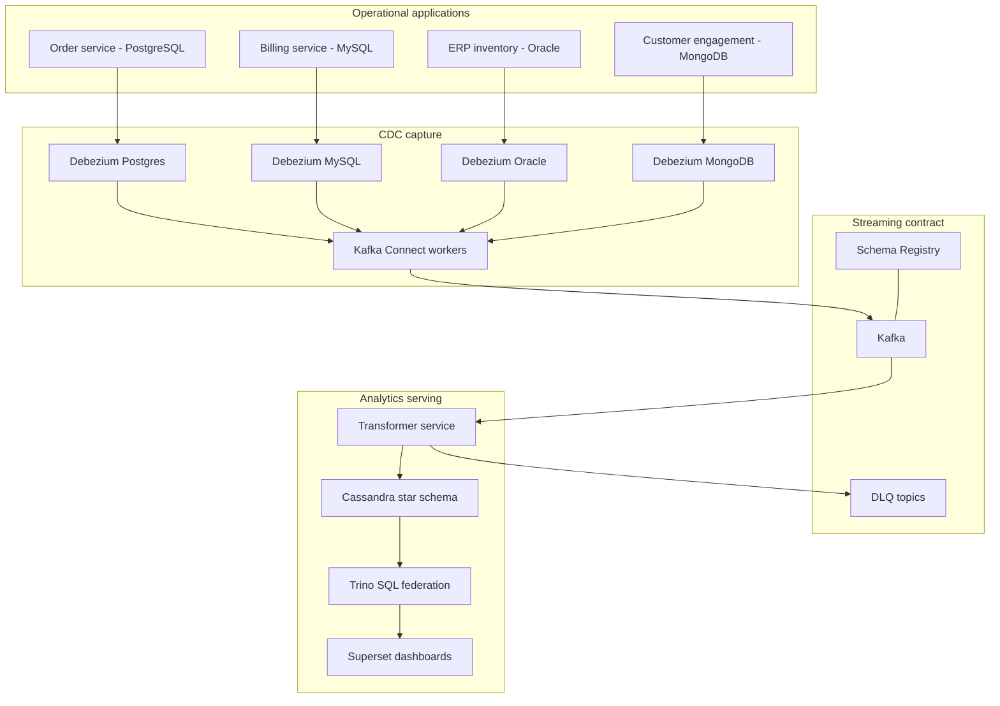

# V2 Production Architecture

## Architecture Decision

Use a CDC-first architecture:

```text
Source DB logs -> Debezium Kafka Connect -> Kafka raw CDC topics -> transformer -> Cassandra star tables -> Trino -> Superset
```

The local demo uses Docker Compose. Production deployment can replace the local components with MSK/MSK Connect, Confluent, Strimzi, Datastream, DMS, or GoldenGate depending on environment.

## Logical Architecture



## Physical Local Architecture

Core profile:

- Kafka in KRaft mode.
- Schema Registry.
- Kafka Connect with Debezium plugins.
- PostgreSQL.
- MySQL.
- MongoDB replica set.
- Cassandra.
- Trino.
- Python transformer package.

Optional profile:

- Oracle Free container for local ERP simulation.

Oracle is optional because it is resource-heavy and often has licensing/operational constraints in real companies. The demo still includes Oracle connector templates and DDL so the architecture conversation is complete. When Oracle is not active, the generator can use a PostgreSQL inventory fallback (`GENERATOR_INVENTORY_SOURCE=postgres-fallback`) that emits `products` and `stock_movements` through the same Debezium/PostgreSQL path as the order service.

## Topic Naming

```text
cdc.local.omnicare.postgres.public.orders
cdc.local.omnicare.postgres.public.order_items
cdc.local.omnicare.postgres.public.products
cdc.local.omnicare.postgres.public.stock_movements
cdc.local.omnicare.mysql.billing.payments
cdc.local.omnicare.mysql.billing.refunds
cdc.local.omnicare.oracle.ERP_APP.STOCK_MOVEMENTS
cdc.local.omnicare.mongo.engagement.support_tickets
```

DLQ topics:

```text
dlq.local.omnicare.transformer
dlq.local.omnicare.connect
```

## Idempotency Strategy

Each transformed fact row includes:

- Source topic.
- Source database.
- Source schema or collection.
- Source table.
- Source operation.
- Source position.
- Source event timestamp.
- A deterministic fact id.

For example:

```text
fact_order_line_id = order_id + line_id + source_position
fact_payment_id = payment_id + source_position
fact_refund_id = refund_id + source_position
fact_inventory_movement_id = movement_id + source_position
fact_support_case_id = ticket_id + source_position
```

If the same CDC event is replayed, the same primary key is produced.

## Target Model

Cassandra is query-first, so the star schema is implemented as dashboard-serving tables rather than a normalized warehouse.

Dimensions:

- `dim_customer_by_id`
- `dim_product_by_id`
- `dim_supplier_by_id`
- `dim_date_by_day`

Facts:

- `fact_order_line_by_day`
- `fact_payment_by_day`
- `fact_refund_by_day`
- `fact_inventory_movement_by_product`
- `fact_support_case_by_customer`
- `fact_customer_health_by_day`

## Dashboard SQL Layer

Trino exposes Cassandra tables to Superset. This gives an interview-friendly separation:

- Cassandra handles serving storage.
- Trino gives SQL access and joins for BI.
- Superset provides dashboards.

## Schema Governance

The CDC contract is committed as `config/contracts/cdc-data-contracts.json` and validated by `tools/validate_contracts.py`.

It ties together:

- Connector include lists.
- Debezium topic naming.
- Transformer mapper coverage.
- Cassandra serving-table columns and keys.
- Captured-only streams that are retained but not yet materialized.

Schema-change rules are documented in `docs/v2/SCHEMA_GOVERNANCE.md`.

## Data Quality Gates

The dashboard API includes runtime data quality checks for query success, non-negative aggregates, event freshness, and order-to-payment reconciliation. `scripts/demo-e2e.sh` runs `tools/quality_gate.py` against the dashboard snapshot before reporting success.

Prometheus exports the same quality status through `omnicare_data_quality_*` metrics, with alert rules for failed and warning states. Details are documented in `docs/v2/DATA_QUALITY.md`.

## Production Deployment Variants

### AWS

```text
RDS/Aurora/EC2 DBs -> MSK Connect/Debezium or DMS -> MSK -> transformer on ECS/EKS/EMR -> Cassandra/Astra/Keyspaces -> Trino/Superset
```

Template path: `infra/deployments/aws`

### GCP

```text
Cloud SQL/Oracle/SQL Server/Mongo sources -> Datastream or Debezium on GKE -> Pub/Sub or Kafka -> Dataflow/transformer -> Cassandra/Astra -> Trino/Superset
```

Template path: `infra/deployments/gcp`

### Datacenter

```text
Source DBs -> Kafka Connect on Kubernetes/VMs -> Kafka/Schema Registry -> transformer -> Cassandra -> Trino/Superset
```

Template path: `infra/deployments/datacenter/helm/omnicare-cdc`

## Non-Goals for First Build Slice

- Fully applied environment-specific Terraform state.
- Enterprise certificate issuance and ACL rollout.
- Full Superset dashboard import.
- Oracle container running by default.
- Exactly-once end-to-end claims.

The committed repo keeps implementation docs, templates, and validation only.
