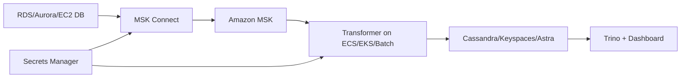
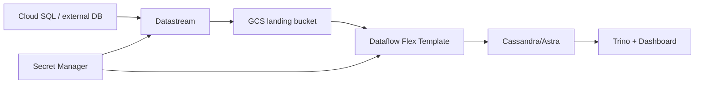
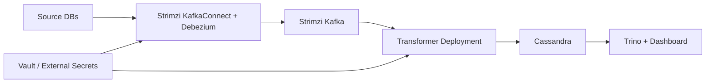

# CDC V2 Deployment Paths

CDCV2-012 adds deployment skeletons for the three production environments discussed in the architecture: AWS, GCP, and datacenter Kubernetes. These templates intentionally avoid real credentials and require the security contract in `docs/v2/security-controls.json`.

## Deployment Matrix

| Environment | Template path | CDC capture | Stream backbone | Transform runtime | Secret provider |
| --- | --- | --- | --- | --- | --- |
| AWS | `deployments/aws` | MSK Connect with Debezium plugins, or DMS for migration-style replication | Amazon MSK | ECS, EKS, or AWS Batch | AWS Secrets Manager |
| GCP | `deployments/gcp` | Datastream for managed capture, or Debezium on GKE for Kafka-compatible capture | Pub/Sub or Kafka-compatible service | Dataflow Flex Template or GKE | Secret Manager |
| Datacenter Kubernetes | `deployments/datacenter/helm/omnicare-cdc` | Kafka Connect with Debezium on Strimzi | Strimzi Kafka | Kubernetes Deployment or Job | Vault / External Secrets |

## AWS Path



Use `deployments/aws` when Kafka topics are part of the long-lived platform contract. The Terraform skeleton creates MSK Connect worker configuration, connector placeholders, log groups, and runtime IAM policy boundaries. Connector configs are environment overlays so CDCV2-016 can add source-specific production templates without mixing secrets into this infrastructure layer.

## GCP Path



Use `deployments/gcp` when managed Datastream and Dataflow operations are preferred. If exact Kafka-compatible Debezium event envelopes are mandatory, run Debezium on GKE and keep the transformer path aligned with the datacenter template.

## Datacenter Kubernetes Path



Use `deployments/datacenter/helm/omnicare-cdc` when the organization owns Kubernetes and Kafka operations. The Helm skeleton defines Strimzi Kafka/KafkaConnect, TLS users, ACLs for the transformer, and runtime deployments for the transformer and dashboard.

## Required Gates

Before applying any environment:

```bash
python tools/validate_deployments.py
python tools/security_check.py
python tools/validate_config.py
```

The templates are skeletons. A production rollout still needs environment-specific networking, image registry, certificate issuance, secret provider wiring, and source database approval.
