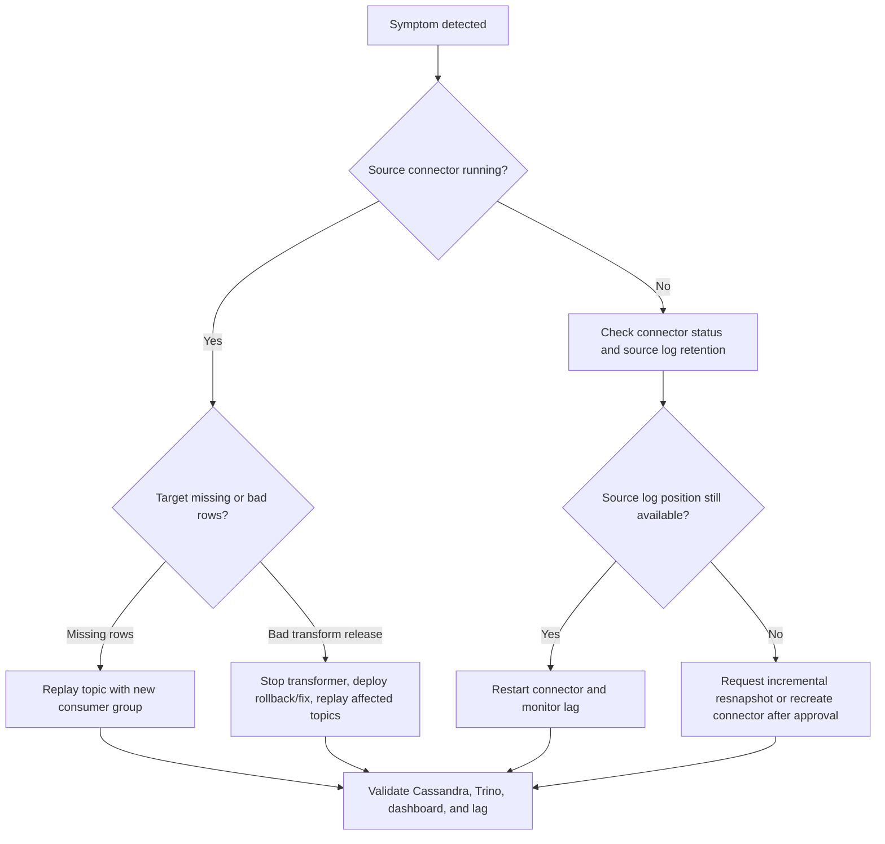

# CDC Replay, Resnapshot, and Recovery Runbooks

These runbooks are written for the local OmniCare CDC stack, but the same operating model applies in production: isolate the failing component, preserve source offsets, use idempotent target writes, and replay with a new consumer group instead of mutating committed offsets in place.

## Operator Safety Rules

- Do not delete Kafka Connect offsets, replication slots, binlog files, MongoDB resume tokens, or Cassandra serving tables unless an incident commander explicitly approves it.
- Prefer additive replay with a new `KAFKA_GROUP_ID`. Dimension writes are upserts; fact rows include `source_position`, so a resnapshot can create a new fact version and may require truncating or deduplicating the affected projection.
- Pause or stop the transformer before deploying a suspect transformer build.
- Record every recovery action with connector name, topic, source position, replay group, and validation query.
- In production, route these commands through your deployment platform and secrets manager. The local scripts intentionally use local Podman and localhost ports.

## Quick Decision Tree



## Prerequisites

Start the local stack and register connectors:

```bash
cp .env.example .env
podman compose --env-file .env -f docker-compose.yaml up -d
ENV_FILE=.env scripts/register-connectors.sh
```

Confirm core health:

```bash
scripts/connect-connector.sh status postgres-orders-local
scripts/connect-connector.sh status mysql-billing-local
scripts/connect-connector.sh status mongo-engagement-local
curl -fsS http://localhost:18091/metrics
curl -fsS 'http://localhost:19090/api/v1/query?query=omnicare_kafka_connect_up'
```

## Runbook 1: Replay One Topic To Cassandra

Use this when Kafka still has the raw CDC events and Cassandra/Trino/dashboard need to be rebuilt or corrected.

1. Pick the exact topic and create a unique replay group.

```bash
scripts/cdc-replay.sh \
  --topic cdc.local.omnicare.postgres.public.order_items \
  --group-id replay-order-items-$(date -u +%Y%m%dT%H%M%SZ) \
  --max-messages 5000 \
  --idle-timeout-seconds 20
```

2. Replay all active demo topics when the target keyspace was recreated.

```bash
scripts/cdc-replay.sh \
  --all-active \
  --group-id replay-active-$(date -u +%Y%m%dT%H%M%SZ) \
  --max-messages 20000 \
  --idle-timeout-seconds 30
```

3. Dry-run before the first production execution.

```bash
scripts/cdc-replay.sh \
  --topic cdc.local.omnicare.mysql.billing.payments \
  --group-id replay-payments-preview \
  --dry-run
```

4. Validate replay progress.

```bash
curl -fsS 'http://localhost:19090/api/v1/query?query=kafka_consumergroup_lag'
curl -fsS http://localhost:18090/api/dashboard
```

Success criteria:

- Replay exits after processing records or after the idle timeout.
- Transformer logs do not show DLQ growth.
- Dashboard summary values move in the expected direction.
- Kafka lag for the replay group reaches zero or stops because no more matching records exist.

## Runbook 2: Resnapshot One Table Or Collection

Use this when the source table/collection is correct but Kafka or Cassandra is missing a subset of records. Active connector templates include Debezium source and Kafka signaling:

```json
"signal.enabled.channels": "source,kafka",
"signal.data.collection": "public.debezium_signal",
"signal.kafka.bootstrap.servers": "${KAFKA_BOOTSTRAP_SERVERS}",
"signal.kafka.groupId": "omnicare-postgres-signals",
"signal.kafka.topic": "${DEBEZIUM_SIGNAL_TOPIC}"
```

The source signal table/collection is required for watermarking incremental snapshots. Fresh local containers create it during init; existing local containers can apply:

```bash
podman exec -i omnicare-postgres-orders psql -U "$POSTGRES_USER" -d "$POSTGRES_DB" < migrations/local/postgres/002_debezium_signal.sql
podman exec -i omnicare-mysql-billing mysql -u"$MYSQL_USER" -p"$MYSQL_PASSWORD" "$MYSQL_DATABASE" < migrations/local/mysql/003_debezium_signal.sql
podman exec -i omnicare-mongo-engagement mongosh < migrations/local/mongo/001_debezium_signal.js
```

The local helper creates the Kafka signal topic before producing the signal. In production, create this topic through IaC with one partition, delete cleanup policy, producer ACL for the operator job, consumer ACL for Kafka Connect, and a unique `signal.kafka.groupId` for every connector that shares the topic.

Local signal collections:

| Connector | Signal key | Source signal collection |
| --- | --- | --- |
| `postgres-orders-local` | `cdc.local.omnicare.postgres` | `public.debezium_signal` |
| `mysql-billing-local` | `cdc.local.omnicare.mysql` | `billing.debezium_signal` |
| `mongo-engagement-local` | `cdc.local.omnicare.mongo` | `engagement.debezium_signal` |
| `oracle-erp-local` | `cdc.local.omnicare.oracle` | `ERP_APP.DEBEZIUM_SIGNAL` |

Request a PostgreSQL incremental snapshot:

```bash
scripts/request-resnapshot.sh \
  --connector postgres-orders-local \
  --data-collection public.customers
```

Request a MySQL incremental snapshot:

```bash
scripts/request-resnapshot.sh \
  --connector mysql-billing-local \
  --data-collection billing.payments
```

Request a MongoDB incremental snapshot:

```bash
scripts/request-resnapshot.sh \
  --connector mongo-engagement-local \
  --data-collection engagement.support_tickets
```

Validate that Debezium accepted and processed the snapshot:

```bash
curl -fsS 'http://localhost:18778/jolokia/search/debezium.*:type=connector-metrics,context=*,*'
curl -fsS 'http://localhost:19090/api/v1/query?query=omnicare_debezium_events_seen_total'
curl -fsS 'http://localhost:19090/api/v1/query?query=omnicare_debezium_source_lag_milliseconds'
```

Then replay the affected Kafka topic with a new group if the transformer was not already running:

```bash
scripts/cdc-replay.sh \
  --topic cdc.local.omnicare.postgres.public.customers \
  --group-id replay-after-resnapshot-$(date -u +%Y%m%dT%H%M%SZ) \
  --max-messages 10000
```

## Runbook 3: Recover From Lost Source Log Position

Use this when a source log position is no longer available, for example:

- PostgreSQL WAL needed by the replication slot was removed.
- MySQL binlog position was purged.
- MongoDB oplog/resume token aged out.

1. Freeze the affected connector.

```bash
scripts/connect-connector.sh stop postgres-orders-local
scripts/connect-connector.sh status postgres-orders-local
scripts/connect-connector.sh offsets postgres-orders-local
```

2. Confirm whether the source log is really lost. In production, this is a database-owner check:

- PostgreSQL: check replication slot restart LSN against retained WAL.
- MySQL: check connector binlog filename/position against retained binlogs.
- MongoDB: check oplog window and connector resume token age.

3. If logs are available, restart and resume the connector.

```bash
scripts/connect-connector.sh restart postgres-orders-local
scripts/connect-connector.sh resume postgres-orders-local
```

4. If logs are not available, request a fresh incremental snapshot for the affected tables/collections.

```bash
scripts/request-resnapshot.sh \
  --connector postgres-orders-local \
  --data-collection public.customers \
  --data-collection public.order_items
```

5. If the connector cannot recover because its stored offset is invalid, reset connector offsets only after approval. Save `scripts/connect-connector.sh offsets CONNECTOR` output in the incident record first.

```bash
scripts/connect-connector.sh reset-offsets postgres-orders-local --yes
scripts/connect-connector.sh restart postgres-orders-local
```

If the connector definition is also invalid or needs to be rebuilt, delete and recreate it only after the same approval.

```bash
scripts/connect-connector.sh delete postgres-orders-local --yes
ENV_FILE=.env scripts/register-connectors.sh
```

6. Replay affected topics into Cassandra using a new replay group.

```bash
scripts/cdc-replay.sh \
  --topic cdc.local.omnicare.postgres.public.customers \
  --topic cdc.local.omnicare.postgres.public.order_items \
  --group-id replay-postgres-after-offset-loss-$(date -u +%Y%m%dT%H%M%SZ) \
  --max-messages 20000
```

Success criteria:

- Connector task returns `RUNNING`.
- Debezium source lag trends down.
- Kafka consumer lag for replay reaches zero.
- Dashboard and Trino validation queries match expected source counts.

## Runbook 4: Recover From A Bad Transformer Release

Use this when raw CDC in Kafka is trusted but Cassandra contains missing, duplicated, or incorrectly transformed rows after a transformer deployment.

1. Stop or pause the bad transformer release. In local Compose:

```bash
podman stop omnicare-transformer
```

2. Deploy the fixed or previous transformer image/version.

```bash
podman compose --env-file .env -f docker-compose.yaml up -d --build transformer
```

3. Identify affected topics. Use the smallest topic set that covers the bad release window.

```bash
podman exec omnicare-kafka kafka-topics --bootstrap-server kafka:9092 --list
```

4. Replay affected topics with a new group. Do not reuse the failed transformer group.

```bash
scripts/cdc-replay.sh \
  --topic cdc.local.omnicare.mysql.billing.payments \
  --group-id replay-after-transformer-fix-$(date -u +%Y%m%dT%H%M%SZ) \
  --max-messages 10000 \
  --idle-timeout-seconds 20
```

5. Validate target and application behavior.

```bash
curl -fsS http://localhost:18090/api/dashboard
curl -fsS 'http://localhost:19090/api/v1/query?query=omnicare_transformer_dlq_records_total'
curl -fsS 'http://localhost:19090/api/v1/query?query=omnicare_transformer_cassandra_write_latency_seconds_count'
```

6. Only after validation, retire or delete the bad deployment.

Success criteria:

- New transformer build has no new DLQ spike.
- Cassandra writes continue with acceptable latency.
- Dashboard values match the expected source-event window.
- Incident notes include replay group ID and affected topics.

## Runbook 5: Remove Bad Serving Facts And Replay Clean Data

Use this when bad facts already reached Cassandra and the dashboard quality gate fails. The local helper is intentionally scoped: it deletes only rows matching an explicit business-id prefix or exact `source_position`, writes an artifact, and then runs the dashboard quality gate.

Typical local recovery after an anomaly or manual bad-data test:

1. Capture the failing dashboard state.

```bash
curl -fsS http://localhost:18090/api/dashboard \
  -o artifacts/dashboard-before-recovery.json
python tools/quality_gate.py \
  --snapshot-file artifacts/dashboard-before-recovery.json
```

2. Preview the cleanup. Use anomaly prefixes for local bad-data runs, or use exact source positions from Cassandra facts when the bad rows came from a known CDC offset.

```bash
scripts/recover-bad-facts.sh \
  --payment-id-prefix PAY-ANOM- \
  --ticket-id-prefix TCK-ANOM- \
  --report-file artifacts/recovery-report.json \
  --dry-run
```

Exact source-position cleanup is also supported. This path uses `ALLOW FILTERING` only to discover primary keys for the explicit position; deletes still use full Cassandra primary keys.

```bash
scripts/recover-bad-facts.sh \
  --source-position 'file:mysql-bin.000001|pos:12345' \
  --report-file artifacts/recovery-report.json \
  --dry-run
```

3. Execute the cleanup with explicit approval.

```bash
scripts/recover-bad-facts.sh \
  --payment-id-prefix PAY-ANOM- \
  --ticket-id-prefix TCK-ANOM- \
  --report-file artifacts/recovery-report.json \
  --yes
```

4. If the deleted rows represented legitimate corrected source data, replay clean CDC with a new group. For local anomaly rows that should not be restored, skip replay.

```bash
scripts/cdc-replay.sh \
  --topic cdc.local.omnicare.mysql.billing.payments \
  --group-id replay-after-bad-fact-cleanup-$(date -u +%Y%m%dT%H%M%SZ) \
  --max-messages 5000 \
  --idle-timeout-seconds 20
```

5. Verify dashboard quality after cleanup or replay.

```bash
curl -fsS http://localhost:18090/api/dashboard \
  -o artifacts/dashboard-after-recovery.json
python tools/quality_gate.py \
  --snapshot-file artifacts/dashboard-after-recovery.json
```

The recovery report records:

- Cleanup scope.
- Matching rows before and after.
- Deleted row count.
- Dashboard quality before and after.
- Final quality gate status.

Success criteria:

- `artifacts/recovery-report.json` has `matchingRowsAfter = 0`.
- No unrelated demo rows were deleted; cleanup scope was a prefix or exact `source_position`.
- Replay, when needed, uses `scripts/cdc-replay.sh` with a new consumer group.
- Dashboard quality returns to `pass`, or the remaining failed checks are documented as a separate incident.

## Production Adaptation

For AWS:

- Replace local Kafka with MSK or MSK Connect.
- Run replay as an ECS task, EKS job, or controlled batch job with a unique consumer group.
- Store connector credentials in Secrets Manager and connector configs in IaC.

For GCP:

- Replace local Kafka with your Kafka platform or Pub/Sub/Dataflow equivalent.
- Run replay as Cloud Run Job, GKE Job, or Dataflow backfill job.
- Store secrets in Secret Manager.

For datacenter Kubernetes:

- Use Strimzi Kafka/Kafka Connect.
- Convert `scripts/cdc-replay.sh` into a Kubernetes Job template.
- Submit Debezium signals through a controlled Kafka producer pod.

## Command Reference

```bash
scripts/connect-connector.sh status postgres-orders-local
scripts/connect-connector.sh config postgres-orders-local
scripts/connect-connector.sh offsets postgres-orders-local
scripts/connect-connector.sh pause postgres-orders-local
scripts/connect-connector.sh resume postgres-orders-local
scripts/connect-connector.sh stop postgres-orders-local
scripts/connect-connector.sh restart postgres-orders-local
scripts/connect-connector.sh reset-offsets postgres-orders-local --yes
scripts/connect-connector.sh delete postgres-orders-local --yes

scripts/request-resnapshot.sh --connector postgres-orders-local --data-collection public.customers
scripts/cdc-replay.sh --topic cdc.local.omnicare.postgres.public.customers --max-messages 1000
scripts/recover-bad-facts.sh --payment-id-prefix PAY-ANOM- --ticket-id-prefix TCK-ANOM- --yes
```
