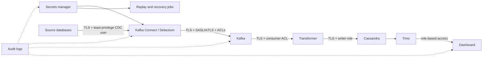

# CDC V2 Security Hardening

This document is the production security contract for the OmniCare CDC V2 demo. The local Compose stack stays intentionally simple, but production must enforce the controls in `docs/v2/security-controls.json`.

## Security Architecture



## Required Controls

| Area | Production control |
| --- | --- |
| Secrets | Git stores only placeholders or references. Runtime values come from AWS Secrets Manager, GCP Secret Manager, Vault, or a Kubernetes secret provider backed by one of them. |
| Database transport | PostgreSQL, MySQL, MongoDB, Oracle, and Cassandra connections use TLS with certificate validation. |
| Kafka transport | Kafka, Kafka Connect, Schema Registry, replay jobs, and transformer clients use TLS plus SASL or mTLS authentication. |
| Kafka ACLs | Each connector, signal consumer group, transformer group, replay job role, and exporter role has separate ACLs. |
| Source access | Every source has a dedicated CDC user with read access only to captured tables/collections plus the Debezium signal table/collection. |
| PII | Captured fields are classified before onboarding. Raw personal data is dropped, masked, tokenized, or restricted before broad dashboard access. |
| Audit | Connector config changes, replay runs, resnapshot requests, offset resets, and dashboard access are logged with operator identity. |

## Secret Handling

Local `.env.example` values are placeholders and are not production credentials. Production connector registration must resolve credentials through the platform, not by committing rendered JSON with passwords.

Recommended mappings:

| Environment | Secret provider | Runtime pattern |
| --- | --- | --- |
| AWS | AWS Secrets Manager | ECS task role, EKS IRSA, or MSK Connect secret integration. |
| GCP | Secret Manager | Workload Identity for GKE/Cloud Run jobs or Dataflow service accounts. |
| Datacenter | HashiCorp Vault | Vault Agent, External Secrets Operator, or Connect config provider. |

Connector secrets that must never be committed:

- Source database usernames and passwords.
- TLS private keys, truststore passwords, wallets, and CA bundles.
- Kafka SASL passwords, mTLS private keys, and Schema Registry credentials.
- Cassandra usernames, passwords, and TLS private keys.
- Dashboard administrator passwords and session-signing secrets.

Production connector templates under `connectors/production/` must use config provider references instead of local environment substitution. They must also declare source TLS settings, Kafka producer/signal TLS settings, and safe logging defaults. `tools/validate_config.py` rejects templates that miss those controls.

## Kafka ACL Model

Use one principal per workload:

| Principal | Allowed access |
| --- | --- |
| `User:cdc-postgres-orders` | Produce Postgres CDC topics, use `omnicare-postgres-signals`, read/write the signal topic. |
| `User:cdc-mysql-billing` | Produce MySQL CDC topics and schema history topic, use `omnicare-mysql-signals`, read/write the signal topic. |
| `User:cdc-mongo-engagement` | Produce MongoDB CDC topics, use `omnicare-mongo-signals`, read/write the signal topic. |
| `User:cdc-oracle-erp` | Produce Oracle CDC topics, use `omnicare-oracle-signals`, read/write the signal topic. |
| `User:omnicare-transformer` | Read approved CDC topics, write DLQ topic, commit `omnicare-cdc-transformer` offsets. |
| `User:omnicare-replay` | Read approved CDC topics with short-lived replay group IDs. No write access except optional replay audit topic. |
| `User:omnicare-observability` | Describe topics and groups only. No data read unless metrics require it. |

## Runtime Security Configuration

The local defaults stay plaintext for Podman developer use, but the transformer now accepts production security settings through environment variables:

| Variable | Purpose |
| --- | --- |
| `KAFKA_SECURITY_PROTOCOL` | `PLAINTEXT`, `SSL`, `SASL_PLAINTEXT`, or `SASL_SSL`; production should use `SSL` or `SASL_SSL`. |
| `KAFKA_SASL_MECHANISM` | Kafka SASL mechanism such as `SCRAM-SHA-512` when SASL is enabled. |
| `KAFKA_SASL_USERNAME` / `KAFKA_SASL_PASSWORD` | Transformer Kafka principal credentials from the secret manager. |
| `KAFKA_SSL_CA_LOCATION` | CA bundle used to validate Kafka broker certificates. |
| `CASSANDRA_USERNAME` / `CASSANDRA_PASSWORD` | Cassandra writer role credentials from the secret manager. |
| `CASSANDRA_SSL_CA_CERT` | CA bundle used to validate Cassandra certificates. |
| `DLQ_INCLUDE_PAYLOADS` | Defaults to `false`; keep disabled in production so failed CDC key/value payloads are redacted. |

## Source Least Privilege

The production users listed in `docs/v2/security-controls.json` are separate from local demo users.

PostgreSQL:

```sql
CREATE ROLE orders_cdc_prod LOGIN REPLICATION PASSWORD '<from-secret-manager>';
GRANT CONNECT ON DATABASE orders TO orders_cdc_prod;
GRANT USAGE ON SCHEMA public TO orders_cdc_prod;
GRANT SELECT ON public.customers, public.orders, public.order_items TO orders_cdc_prod;
GRANT SELECT ON public.products, public.stock_movements TO orders_cdc_prod;
GRANT SELECT, INSERT, UPDATE, DELETE ON public.debezium_signal TO orders_cdc_prod;
```

MySQL:

```sql
CREATE USER 'billing_cdc_prod'@'%' IDENTIFIED BY '<from-secret-manager>' REQUIRE SSL;
GRANT SELECT ON billing.invoices TO 'billing_cdc_prod'@'%';
GRANT SELECT ON billing.payments TO 'billing_cdc_prod'@'%';
GRANT SELECT ON billing.refunds TO 'billing_cdc_prod'@'%';
GRANT SELECT, INSERT, UPDATE, DELETE ON billing.debezium_signal TO 'billing_cdc_prod'@'%';
GRANT REPLICATION SLAVE, REPLICATION CLIENT, SHOW DATABASES ON *.* TO 'billing_cdc_prod'@'%';
```

MongoDB:

```javascript
db.getSiblingDB("admin").createUser({
  user: "engagement_cdc_prod",
  pwd: "<from-secret-manager>",
  roles: [
    { role: "read", db: "engagement" },
    { role: "read", db: "local" }
  ]
});
```

Oracle:

```sql
CREATE USER ERP_CDC_PROD IDENTIFIED BY "<from-secret-manager>";
GRANT CREATE SESSION TO ERP_CDC_PROD;
GRANT SELECT ON ERP_APP.PRODUCTS TO ERP_CDC_PROD;
GRANT SELECT ON ERP_APP.SUPPLIERS TO ERP_CDC_PROD;
GRANT SELECT ON ERP_APP.STOCK_MOVEMENTS TO ERP_CDC_PROD;
GRANT SELECT, INSERT, UPDATE, DELETE ON ERP_APP.DEBEZIUM_SIGNAL TO ERP_CDC_PROD;
```

Oracle LogMiner privileges should be granted through a reviewed CDC role maintained by the DBA team.

## PII Classification

The structured inventory is in `docs/v2/security-controls.json`. Operational rule:

1. Classify every captured source field before onboarding.
2. Mark direct identifiers as `restricted` and do not capture them unless the business case is approved.
3. Treat customer IDs as pseudonymous identifiers; hash or tokenize them before broad BI access.
4. Keep payment data category-only. Do not collect card numbers, CVV, bank account numbers, or raw payment provider tokens.
5. Expose only aggregates in executive dashboards unless a role-based drill-down has explicit approval.

## Masking And Transformation

Current demo fields are intentionally synthetic and limited. Production masking belongs at one of these layers:

- Source-side column exclusion for fields that should never enter Kafka.
- Debezium SMT masking or hashing for simple deterministic transforms.
- Transformer masking/tokenization before Cassandra writes when dashboard joins require a stable surrogate.
- BI access controls for drill-down fields that remain sensitive after transformation.

## Production Readiness Checklist

- [ ] All connector passwords and TLS materials resolve from a secret manager.
- [ ] Source databases require TLS and reject password-only plaintext access.
- [ ] Kafka clients use TLS plus SASL or mTLS.
- [ ] Kafka ACLs are applied per connector, transformer, replay job, and observability role.
- [ ] Source CDC users are reviewed by the database owner.
- [ ] PII inventory is approved by data governance.
- [ ] Cassandra writer and dashboard reader roles are separate.
- [ ] Replay, resnapshot, connector offset reset, and connector delete operations require audited approval.
- [ ] `python tools/security_check.py` and `python tools/validate_config.py` pass in CI.
