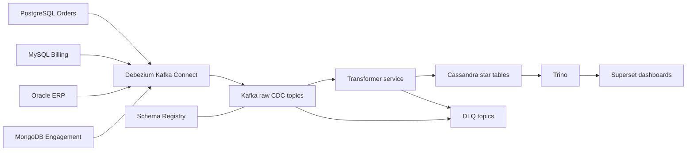

# V2 Use Case: OmniCare Operations Intelligence

## Goal

Build a production-grade CDC demo where several independent applications own different databases, and a central analytics platform uses CDC to build dashboard-ready Cassandra tables.

The business is a healthcare commerce and claims operations company:

- Hospitals order medical products.
- Inventory is managed in a legacy ERP.
- Payments and invoices are handled by a billing service.
- Customer support and engagement data live in a document database.
- Executives need one operations dashboard across all of those systems.

## Source Applications

| Application | Database | Why this database is realistic | Core entities |
|---|---|---|---|
| Order Management | PostgreSQL | Modern transactional service with relational order data | `orders`, `order_items`, `customers` |
| Billing and Payments | MySQL | Common choice for payment/invoice microservices | `payments`, `invoices`, `refunds` |
| ERP Inventory | Oracle | Common legacy enterprise system | `products`, `stock_movements`, `suppliers` |
| Customer Engagement | MongoDB | Flexible documents for tickets, notes, touchpoints | `support_tickets`, `customer_events` |

## Target

Cassandra is used as the serving layer for dashboard reads. The transformed model is star-schema inspired, but adapted to Cassandra query patterns.

Dashboard access path:

```text
Cassandra dashboard tables -> Trino -> Superset dashboards
```

Why this is a good demo:

- It shows multi-database CDC, not only one Postgres source.
- It shows source ownership boundaries: each app has its own database.
- It shows transformation from operational models into analytical facts and dimensions.
- It keeps Cassandra as a realistic low-latency serving layer.
- It can be explained in interviews as an enterprise CDC pattern.

## Dashboard Questions

The dashboard should answer:

1. What is order revenue today, this week, and this month?
2. Which products are at risk because orders are growing while stock is low?
3. Which customers have unpaid invoices or failed payments?
4. Which support tickets are breaching SLA?
5. What is the order-to-cash cycle time from order placement to payment capture?
6. Which hospitals are high-value but operationally unhealthy?

## Star Schema

Dimensions:

- `dim_customer`
- `dim_product`
- `dim_supplier`
- `dim_date`
- `dim_channel`

Facts:

- `fact_order_line`
- `fact_payment`
- `fact_inventory_movement`
- `fact_support_case`
- `fact_daily_customer_health`

## End-to-End Flow



## Production Positioning

For the interview, describe this as:

> Each operational application owns its database. I use CDC to publish committed changes from each source log into Kafka. Kafka is the durable integration contract. A transformation service builds idempotent dashboard projections in Cassandra. Trino exposes Cassandra to BI tooling, and Superset renders dashboards. The design includes schema governance, DLQ, secrets, monitoring, replay, and idempotent writes.

